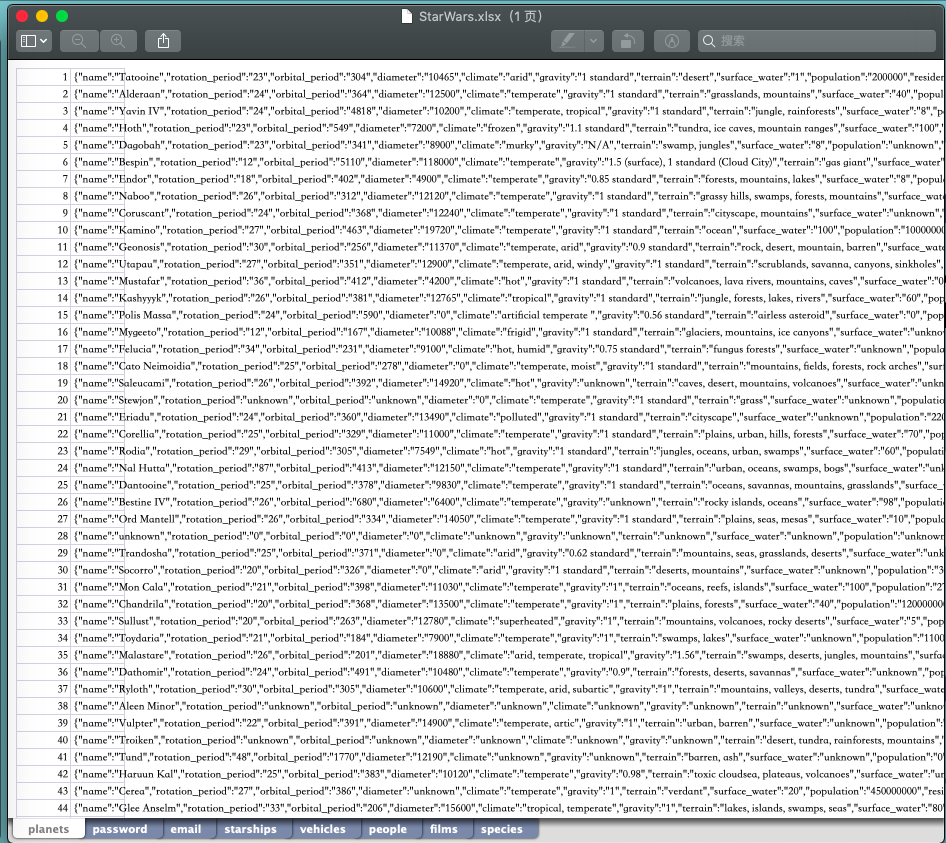

# 服务计算之boltDB数据库使用总结
熊秭鉴
16340259

## 本人承担的工作
实现后端数据库，根据小组成员爬虫爬下来的数据生成数据库，为后端的其他部分提供数据库相应功能的接口
## 数据库学习以及使用心得
### 构造数据库之前
不得不说，在这次的开发中，用boltDB的确是十分的方便和人性化。我们小组负责爬虫的同学爬下来的数据是这样的：


然后boltDB数据库最大的特点就是，它采用键值对的方式来存储数据，然后我们组我们组爬下来的数据刚好是前一列是id，后一列是所有信息，极大地方便了数据库的构造。

### 为构造数据而学习的知识
首先我想安利一下一款boltDB的可视化工具，采用这款工具可以让你极其方便的在命令行查看数据库里的内容。
先贴一个github的链接：[可视化工具](https://github.com/hasit/bolter)


输入桶的名字还可以进一步的显示桶里的内容

### boltDB的学习
这次使用boltDB数据库，要学习到的知识有这些：
#### 1.安装
```shell
go get github.com/boltdb/bolt
```
#### 2.创建和启动数据库
```go
db, err := bolt.Open("my.db", 0600, nil)
```

其中open的第一个参数为路径,如果数据库不存在则会创建名为my.db的数据库， 第二个为文件操作，第三个参数是可选参数， 内部可以配置只读和超时时间等，
特别需要注意的地方就是因为boltdb是文件操作类型的数据库，所以只能单点写入和读取，如果多个同时操作的话后者会被挂起直到前者关闭操作为止， boltdb一次只允许一个读写事务，但一次允许多个只读事务。所以数据具有较强的一致性。(这里尤其需要注意一下，前文所说到的可视化工具和我们的程序调用数据库是不能同时进行的，因为boltdb单点写入和读取特性，所以当一个点在运行的时候，另一个点的请求会被挂起)

因此单个事务和从它们创建的所有对象（例如桶、键）都不是线程安全的。与数据在多个概念你必须为每一个或使用锁机制来保证只有一个goroutine里操作改变数据。
只读事务和读写事物通常不应该在同一个goroutine里同时打开。由于读写事务需要周期性地重新映射数据文件，这可能导致死锁。

#### 3.构建数据库
爬虫爬下来的数据是存在xlsx表格里面，所以这里需要读取xlsx表格并写入数据库。这里需要用到的库的链接如下(注意：只能是xlsx不能是xls)：
[读取xlsx文件的go语言库](https://github.com/360EntSecGroup-Skylar/excelize)

这里贴出读取xlsx文件的示例代码：
```go
package main

import (
    "fmt"

    "github.com/360EntSecGroup-Skylar/excelize"
)

func main() {
    xlsx, err := excelize.OpenFile("./Book1.xlsx")
    if err != nil {
        fmt.Println(err)
        return
    }
    // Get value from cell by given worksheet name and axis.
    cell := xlsx.GetCellValue("Sheet1", "B2")
    fmt.Println(cell)
    // Get all the rows in the Sheet1.
    rows := xlsx.GetRows("Sheet1")
    for _, row := range rows {
        for _, colCell := range row {
            fmt.Print(colCell, "\t")
        }
        fmt.Println()
    }
}
```

#### 4.数据库的基本操作
##### 往桶里增加一个键值对
```go
if err := db.Update(func(tx *bolt.Tx) error {
    if _, err := tx.CreateBucketIfNotExists([]byte("桶名")); err != nil {//判断是否存在
        logger.Log("create failed", err.Error())
        return err
    }
    b := tx.Bucket([]byte("桶名"))
    err = b.Put([]byte("键值对的key"), []byte("键值对的value"))
    return err
}); err != nil {
    logger.Log("update error is:", err.Error())
}
```

##### 获取一个值
```go
if err := db.View(func(tx *bolt.Tx) error {
    b := tx.Bucket([]byte("桶名"))
    v := b.Get([]byte("键值对的key"))
    fmt.Printf("the data is :%s\n", v)
    return nil
}); err != nil {
    logger.Log("view error :", err.Error())
}
```
##### foreach函数遍历数据库里的某个桶
```go
db.View(func(tx *bolt.Tx) error {
b := tx.Bucket([]byte("桶名")) //这个桶必须存在！！！
b.ForEach(func(k, v []byte) error {
fmt.Printf("key=%s, value=%s\n", k, v)
return nil
})
return nil
})
```
